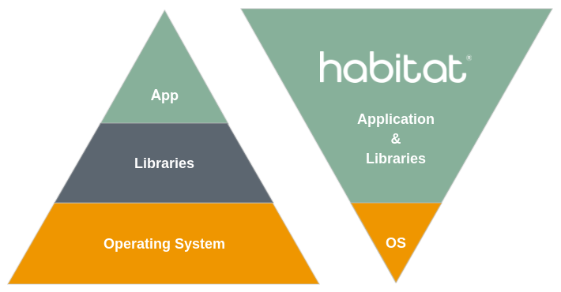
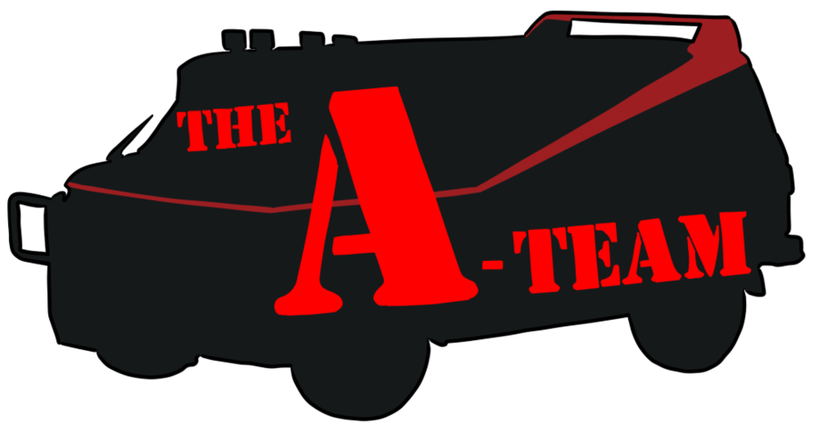
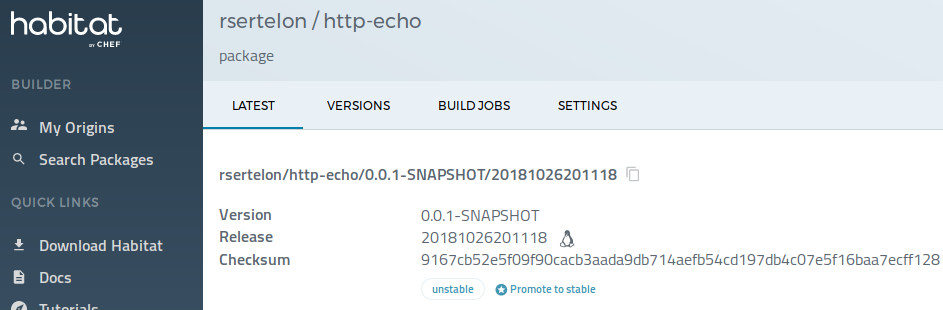
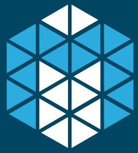

#### Application that travels with the app

-----

## Whoami

@rsertelon

<p class="fragment" style="display:flex;align-items:center;margin:0 auto;width:380px"><span>Tech lead @ Nuxeo</span> </p>

<p class="fragment" style="display:flex;align-items:center;margin:0 auto;width:590px"> <span style="margin-left:5px">Habitat core plans maintainer</span></p>

-----

## A Little Background First

---

### Context

4 years

2 developers

Monolith to µServices

Simplest Infrastructure possible

---

### Infrastructure

2 envs

8 services

"Container" tarballs

Manual deployments each sprint

---

### Our needs

"No more SSH"

Config Management

Continuous Deployment

<p>
Infrastructure Agnostic Tooling<br/>
<span style="font-size:.5em;">(to adapt easily to ops changes)</span>
</p>

-----


---

### The project

<p class="fragment" style="display:flex;align-items:center;margin:0 auto;width:330px"><span style="margin-right:10px">Backed by</span> </p>

Announced in June, 2016 <!-- .element: class="fragment" -->

Early adopters community <!-- .element: class="fragment" -->

Core team current focus is on 1.0 <!-- .element: class="fragment" -->

---

### Innovative vision

_"Application Automation"_ <!-- .element: class="fragment" -->



---

### What it does

Packages your application <!-- .element: class="fragment" -->

Runs your application <!-- .element: class="fragment" -->

<p class="fragment">Adds automation _around_ your application</p>

-----

## Package Your Application

---

### Studio

```bash
$ hab studio enter # Clean slate, isolated environment
```

---

### Plan

```bash
pkg_origin=rsertelon
pkg_name=http-echo
pkg_version=0.1.0
pkg_deps=(core/jre8)
pkg_build_deps(core/maven)

do_build() {
    mvn clean verify
}

do_install() {
    cp *.jar ${pkg_prefix}
}
```

---

### Build

```bash
$ hab pkg build plan.sh

...

I love it when a plan.sh comes together.

$ ls results/
rsertelon-http-echo-0.1.0-20181029153000-x86_64-linux.hart
```



---

### Deploy



Available on premise <!-- .element: class="fragment" -->

---

 ### Export

<div style="display:flex;height:142px;justify-content:space-around">
 
 
 
 
 
 
</div>

Or maybe not? <!-- .element: class="fragment" -->

-----

## Run Your Application

---

### Supervisor

Supervises your service(s) <!-- .element: class="fragment" -->

Manages service configuration <!-- .element: class="fragment" -->

Can update the service package <!-- .element: class="fragment" -->

---

### Distributed Intelligence

Supervisors can peer <!-- .element: class="fragment" -->

Service groups <!-- .element: class="fragment" -->

Coordination <!-- .element: class="fragment" -->

-----

## Automate

---

### Continuous Delivery

Builder

Reverse Deps Rebuilds

---

### Continuous Deployment

Depot Channels

Supervisors channel subscription

-----

## Demo

-----

## Summary

---

## How Habitat helped us

1 week

Jenkins integration

Centralized configuration

"Future proof" for Infrastructure

---

## How it could help you

Common packaging for every apps

Common config management interface

Technical interface between dev and ops

-----

## That's all folks!

<p style="font-size:.7em">https://www.habitat.sh</p>

-----

## Questions?

<p style="font-size:.7em">https://www.habitat.sh</p>